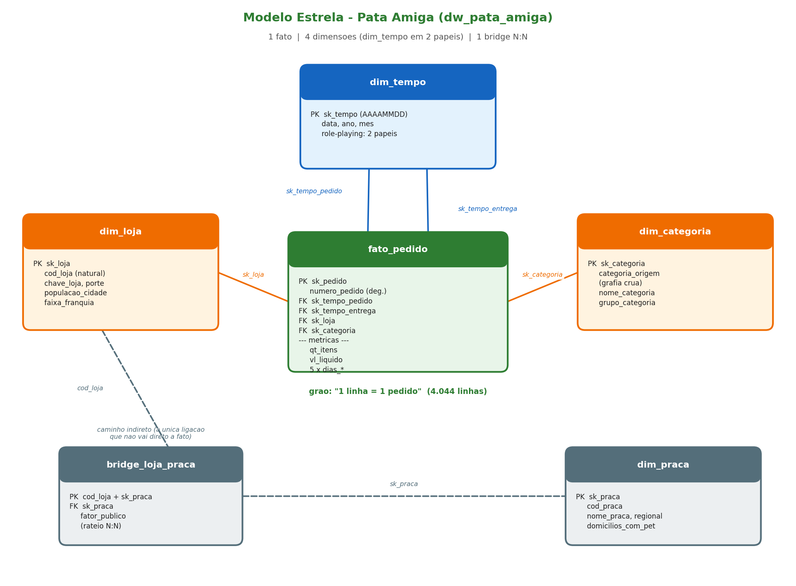

# Pata Amiga — Modelo Dimensional e Análise de Dados (MySQL 8.0)

Mini-Projeto Avaliativo · Módulo 2 · Análise de Dados com Python [T2]
Autor: **Daniel Régis**

---

## 1. O case

A **Pata Amiga** é uma rede catarinense de pet shops com 32 lojas. Entre
setembro/2023 e março/2024 ela registrou **4.044 pedidos** por app, site,
telefone, WhatsApp e loja física. O problema: os dados moram em três sistemas
que não conversam — a plataforma de e-commerce, o cadastro de lojas do
franchising e a planilha de praças de atendimento. A mesma loja aparece com
acento, sem acento, em caixa alta e com erro de digitação; a mesma categoria
tem várias grafias; datas e valores vêm como texto.

A diretoria quer **cinco respostas, com número, e saber de onde veio cada
número**. Este repositório entrega um modelo estrela em MySQL que reconcilia as
três bases e responde às cinco perguntas de negócio.

---

## 2. O modelo dimensional



Uma fato no centro, quatro dimensões e uma tabela ponte:

| Tabela | Grão | Papel |
|---|---|---|
| **fato_pedido** | 1 linha = 1 pedido (4.044) | métricas: `qt_itens`, `vl_liquido`, 5 lags de dias |
| **dim_tempo** | 1 dia | *role-playing*: ligada duas vezes (data do pedido e data da entrega) |
| **dim_loja** | 1 loja | pronta; `chave_loja` é o nome padronizado (caixa alta, sem acento) |
| **dim_categoria** | 1 grafia da origem | guarda a grafia crua em `categoria_origem`; a fato acha a linha por ela |
| **dim_praca** | 1 praça de atendimento | 12 praças + a linha -1 |
| **bridge_loja_praca** | 1 loja × 1 praça | resolve o N:N com o `fator_publico` de rateio |

Decisões estruturais:

- **Chaves surrogate** (`AUTO_INCREMENT`) nas dimensões que eu construí; a
  chave natural fica como atributo.
- **Toda dimensão tem a linha -1 = "Nao Informado"**, inserida *antes* do
  `INSERT ... SELECT`. Nenhuma FK da fato fica nula: quando o dado falta, ela
  aponta para a -1.
- **`dim_praca` só se liga à fato pela ponte**, via `cod_loja`. É o único
  caminho indireto do modelo — necessário porque uma loja atende mais de uma
  praça (N:N não cabe numa FK).
- **`houve_desconto` e `canal_pedido` ficam na própria fato** (dois domínios de
  poucos valores, sem nada pendurado neles). `numero_pedido` é uma dimensão
  degenerada. Das várias colunas de dinheiro da origem, só `vl_liquido` entra —
  é a única que as perguntas usam.

---

## 3. Como reproduzir o banco do zero

Pré-requisito: **MySQL 8.0**. Rode os scripts **nesta ordem**, do mesmo diretório:

```bash
mysql -u root -p < "arquivos prontos para os alunos usarem/01-carga-staging.sql"      # cria o banco e as 3 stg_
mysql -u root -p < "arquivos prontos para os alunos usarem/02-dimensoes-prontas.sql"  # dim_tempo, dim_loja + tabelas vazias
mysql -u root -p dw_pata_amiga < "arquivos para completar/03-dimensoes.sql"           # dim_categoria, dim_praca, bridge
mysql -u root -p dw_pata_amiga < "arquivos para completar/04-fato.sql"                # fato_pedido (4.044 linhas)
mysql -u root -p dw_pata_amiga < "arquivos para completar/05-perguntas.sql"           # as 5 respostas
```

O arquivo `arquivos prontos para os alunos usarem/00-conferencia.sql` traz as
contagens de checagem de cada etapa (não faz parte da carga).

Os arquivos `01` e `02` vieram prontos e **representam a origem — não devem ser
alterados** (nada de `UPDATE`, nada de `ALTER`). Todo tratamento acontece nos
`INSERT` dos arquivos `03` e `04`.

### Conferência (todos bateram nesta entrega)

| Etapa | O que confere | Esperado | Obtido |
|---|---|---|---|
| 01 | stg_pedido / stg_loja / stg_loja_praca | 4.044 / 32 / 48 | ✅ |
| 01 | pedidos sem Cod Loja | 1.575 (~39%) | ✅ |
| 01 | pedidos sem nome de loja | 3 | ✅ |
| 03 | dim_categoria (nomes padronizados) | 8 (7 + a -1) | ✅ |
| 03 | dim_praca / bridge | 13 / 48 | ✅ |
| 03 | soma do fator por loja | 1,00 | ✅ |
| 04 | fato_pedido | 4.044 | ✅ |
| 04 | FKs nulas ou órfãs | 0 | ✅ |
| 04 | entregas não concluídas (tempo -1) | 1.953 | ✅ |
| 05 | faturamento total da rede | 1.793.309 | ✅ |
| 05 | soma rateada por praça + sem loja − total | 0 | ✅ |

---

## 4. Diagnóstico da origem (Tarefa 1)

O que está errado em cada base, medido em SQL:

- **stg_pedido** — todas as colunas em texto; **18 grafias** para 7 categorias;
  **50 grafias** de nome de loja; duas máscaras de data na mesma tabela (pedido
  em `MM/DD/AAAA` americano, marcos da entrega em `AAAA-MM-DD`); dinheiro como
  `R$ 1.850,00`, `1850.00`, `1.200`, `-` e vazio, tudo junto; **1.575 pedidos
  (~39%) sem Cod Loja** e **3 sem nome de loja**.
- **Marcos de processo em branco** (processo em aberto, não erro):
  separação 1.077, nota 1.338, despacho 1.665, entrega **1.953**.
- **A pegadinha das categorias**: "Racao Medicamentosa" contém "RA", mas **não é
  ração, é medicamento**. Por isso o `CASE` do de-para testa `MED` antes de `RA`.
- **A máscara de data mais cara**: usar `%d/%m/%Y` na data do pedido não dá
  erro — o MySQL devolve NULL e datas trocadas em silêncio. Medi: a máscara
  americana valida **4.044** datas; a brasileira, só 1.556. Usei a americana.

---

## 5. Decisões de tratamento

| Campo | Decisão |
|---|---|
| **Data do pedido** | `STR_TO_DATE(x, '%m/%d/%Y %h:%i %p')` (formato americano com AM/PM) |
| **Marcos da entrega** | já em ISO: `DATE(x)` basta |
| **Chave de tempo** | `CAST(DATE_FORMAT(data, '%Y%m%d') AS SIGNED)` — a fato monta a FK por cálculo, sem JOIN |
| **Nome da loja** | `REPLACE` tira `/SC` e o espaço duplo; um `CASE` resolve 3 grafias que sobram (erro de digitação *Blumenal*, apelido *Floripa*, abreviação *Jgua*) |
| **Categoria** | de-para por `CASE ... LIKE` em `UPPER`, sem acento, com **MED antes de RA** |
| **Canal** | `CASE` com **WHATS antes de APP** (senão "WhatsApp" cairia em "App", pois contém "APP") — resultado: 414 pedidos de WhatsApp preservados |
| **Desconto** | `S/SIM/1/X/TRUE/V → Sim`; `N/NAO/0/FALSE/F → Nao`; resto → Nao Informado |
| **Valor** | `''` e `'-'` viram **NULL, nunca 0**; remove `R$`, ponto de milhar, troca vírgula por ponto |
| **Lags de dias** | `DATEDIFF(fim, início)`; etapa não cumprida grava **NULL** (nunca 0, senão a média mentiria) |

A limpeza vive nas dimensões; a fato apenas **procura a linha certa** por JOIN.

---

## 6. As cinco respostas

### P1 — Onde está o gargalo da entrega?

Tempo médio (dias) por porte de loja:

| Porte | Integr→Sep | Sep→Nota | **Nota→Despacho** | Despacho→Entrega | **Total** |
|---|---|---|---|---|---|
| Pequena | 3,0 | 0,7 | **8,5** | 2,9 | **15,2** |
| Média | 2,0 | 0,6 | 3,3 | 2,0 | 8,0 |
| Grande | 2,0 | 0,6 | 3,3 | 2,0 | 7,9 |

**O gargalo é o intervalo Nota → Despacho**, e é o mesmo nos três portes. Nas
lojas **Pequenas** ele explode para 8,5 dias (contra 3,3 nas demais), dobrando
o tempo total de entrega. O gargalo não está na estrada (despacho→entrega é
rápido em todo porte), está **entre emitir a nota e o produto sair da loja**.

### P2 — Qual categoria concentra o faturamento?

| Categoria | Grupo | Faturamento | % do total |
|---|---|---|---|
| **Racao** | Alimentacao | R$ 1.076.203 | **60,0%** |
| Medicamento | Saude e Higiene | R$ 305.904 | 17,1% |
| Petisco | Alimentacao | R$ 128.590 | 7,2% |
| Servico | Bem-estar | R$ 94.001 | 5,2% |
| Higiene | Saude e Higiene | R$ 92.314 | 5,1% |
| Acessorio | Bem-estar | R$ 64.661 | 3,6% |
| Brinquedo | Bem-estar | R$ 31.635 | 1,8% |

**Ração sustenta 60% do faturamento**, sozinha. Somada a Medicamento, chega a
77%. É a categoria campeã em todos os portes de loja.

### P3 — O desconto funciona igual em todo canal?

Ticket médio por canal:

| Canal | Com desconto | Sem desconto | % do faturamento |
|---|---|---|---|
| App | R$ 488,04 | R$ 167,63 | 30,8% |
| Site | R$ 501,92 | R$ 189,68 | 25,1% |
| Loja Física | R$ 494,04 | R$ 197,55 | 20,1% |
| WhatsApp | R$ 514,33 | R$ 179,26 | 10,5% |
| Telefone | R$ 514,02 | R$ 195,23 | 6,9% |

**A política de desconto é uniforme entre canais**: em todos, o ticket com
desconto é ~2,7× o ticket sem desconto (o desconto acompanha pedidos grandes,
não é um canal específico que puxa a régua). Os canais digitais (App + Site)
respondem por **56% do faturamento**.

### P4 — Qual praça concentra o faturamento?

Faturamento rateado pelo `fator_publico` (para não contar duas vezes quem
atende mais de uma praça):

| Praça | Regional | Domicílios c/ pet | Faturamento rateado | R$ / domicílio |
|---|---|---|---|---|
| **Vale do Itajai** | Leste | 148.000 | **R$ 633.746** | **4,28** |
| Grande Florianopolis | Leste | 132.000 | R$ 283.547 | 2,15 |
| Norte Industrial | Norte | 96.000 | R$ 175.432 | 1,83 |
| Litoral Sul | Sul | 58.000 | R$ 137.051 | 2,36 |
| Litoral Norte | Norte | 61.000 | R$ 128.873 | 2,11 |
| *(demais 7 praças)* | | | | |

**O Vale do Itajaí concentra 35% do faturamento da rede** e tem o maior
faturamento por domicílio com pet (4,28) — bem acima da segunda colocada. A
soma rateada de todas as praças mais os pedidos sem loja fecha exatamente com o
total da rede (diferença = 0).

### P5 — Onde abrir a próxima loja, e o que os dados NÃO permitem afirmar?

**(a) Ranking por itens por mil habitantes** (penetração, não valor absoluto):

| Loja | Cidade | Itens/mil hab | Entrega média (dias) |
|---|---|---|---|
| Rio dos Cedros | Rio dos Cedros | 41,87 | 14,2 |
| Presidente Getulio | Presidente Getúlio | 34,84 | 14,2 |
| Ibirama | Ibirama | 32,07 | 15,4 |
| Itapoa | Itapoá | 25,94 | 15,4 |
| Santo Amaro da Imperatriz | Santo Amaro | 23,71 | 15,9 |

As lojas de maior penetração são **pequenas, do interior do Vale**, mas todas
têm entrega lenta (~14-16 dias, o dobro da média). As grandes de capital
(Florianópolis 2,65, Itajaí 3,02) ficam no fim do ranking por habitante.

**Recomendação:** a próxima loja tem mais sinal no **eixo do Vale do Itajaí** —
a praça que já lidera faturamento (P4) e onde as cidades vizinhas mostram alta
penetração por habitante (P5a). Uma unidade nova ali também ataca o gargalo da
P1: encurta o trajeto Nota→Despacho que hoje penaliza as pequenas do interior.

**(b) O que os dados NÃO permitem afirmar.** O faturamento por faixa de
franquia **atual** é Ouro R$ 1.011.264, Diamante R$ 382.210, Prata R$ 314.812,
Bronze R$ 84.036. Mas isso **não responde "quanto veio de lojas que já eram Ouro
na data do pedido"**: o cadastro (`dim_loja`) só guarda a foto de hoje
(`DtUltimaAtualizacao = 31/03/2024`); o histórico de faixa foi sobrescrito. Uma
loja que era Prata em setembro e virou Ouro em março aparece como Ouro em todos
os seus pedidos.

**(c) O que ficou de fora:**

| Limitação | Pedidos |
|---|---|
| Sem loja identificada (foram para a linha -1) | 3 |
| Entregas ainda não concluídas | 1.953 |
| `qt_itens` em branco (NULL) | 257 |
| `vl_liquido` em branco (NULL) | 121 |

As 1.953 entregas em aberto não entram nas médias de tempo (por isso os lags
usam NULL, não 0). Os 3 pedidos sem loja entram no faturamento total, mas não no
rateio por praça — daí a diferença de R$ 986 que fecha a conta da P4.

---

## 7. Estrutura do repositório

```
.
├── README.md                        <- este documento
├── diagrama/
│   ├── modelo_estrela.png           <- diagrama do modelo (imagem)
│   └── gerar_diagrama.py            <- script que gera o diagrama
├── arquivos prontos para os alunos usarem/
│   ├── 00-conferencia.sql           <- checagens (não é entrega)
│   ├── 01-carga-staging.sql         <- origem: cria banco + 3 stg_
│   └── 02-dimensoes-prontas.sql     <- dim_tempo, dim_loja + tabelas vazias
├── arquivos para completar/
│   ├── 03-dimensoes.sql             <- dim_categoria, dim_praca, bridge  [meu]
│   ├── 04-fato.sql                  <- fato_pedido                       [meu]
│   └── 05-perguntas.sql             <- as 5 consultas de negócio         [meu]
└── dados brutos/                    <- CSVs de origem (referência)
```

## 8. Vídeo

> _(link do vídeo de até 5 minutos — Google Drive — a inserir)_
